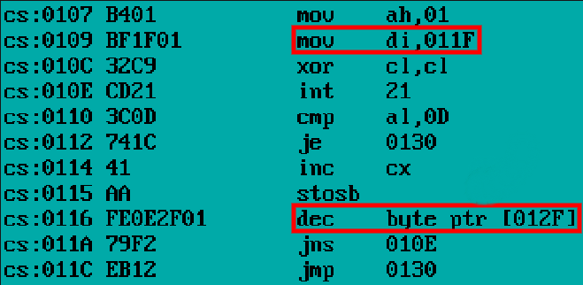
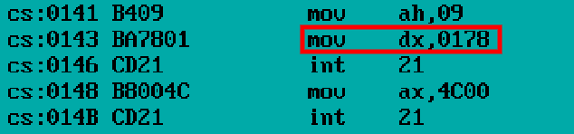
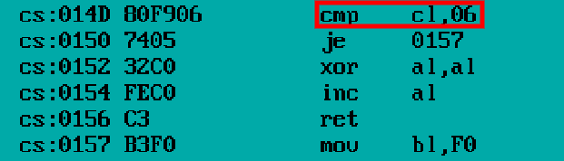

# .COM PROGRAM CRACKING

## ABOUT

Поиск уязвимостей в программе `PASSW_origin.COM`. Программа ожидает на ввод пароль:

---

---

При ошибочном вводе ожидается:

---

---

А при правильном:

---

---

## BUFFER OVERFLOW

Первая найденная уязвимость была связана с переполнением буфера. Как видно из дизассемблиированного сегмента:

---

---

Мы считываем символы из командной строки и помещаем по адресу `011F` До тех пор, пока не будет введен символ `0D=\n` или некий счётчик по адресу `012F` не станет отрицательным, после чего осуществляется безусловный переход по адресу `0130`. Посмотрим что находится по адресу `011F`:

---

---

Можно заметить, что счётчик по адресу `012F` равен 16 и будет перезаписан при количестве вводимых символов больше 16 до проверки счетчика, что позволит нам поместить далее по адресу `0130` вредоносный код. Если посмотреть куда ведёт команда `je 0141`, то мы увидим следующий код:

---

---

Который выводит строку, содержащуюся по адресу `0178`:

---

---

То есть нам нужно переполнением буфера затереть часть кода до условного перехода по адресу `0141` и сделать его безусловным. Например подойдет строка из файла `cracking_means/HACK.TXT`.

## PASSWORD ENCRYPTION

Вторая найденная уязвимость состоит в том, что шифрование пароля слабое. Из дзассемблера видно:

---

---

что пароль записан по адресу `0177` в обратном порядке и его длина `6` символов. В файле `cracking_means/HACK.ASM` представлен дешифратор пароля, который оказался равен `Rbctsh`.

## C cracking

Также в папке `cracking_means` представлена программа на `C`, которая переводит `PASSW_origin.COM` в `PASSW_patched.COM`, напрямую меняя машинный код.
