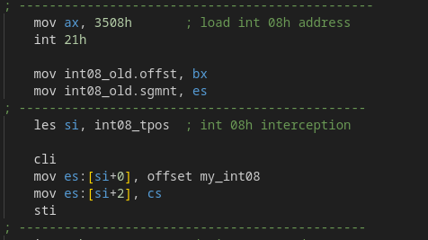
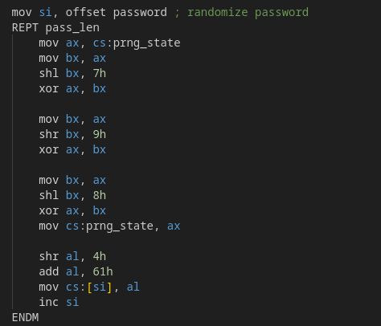
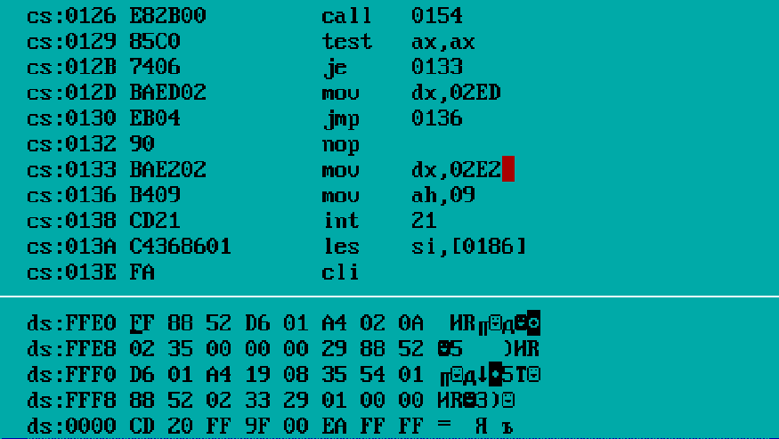
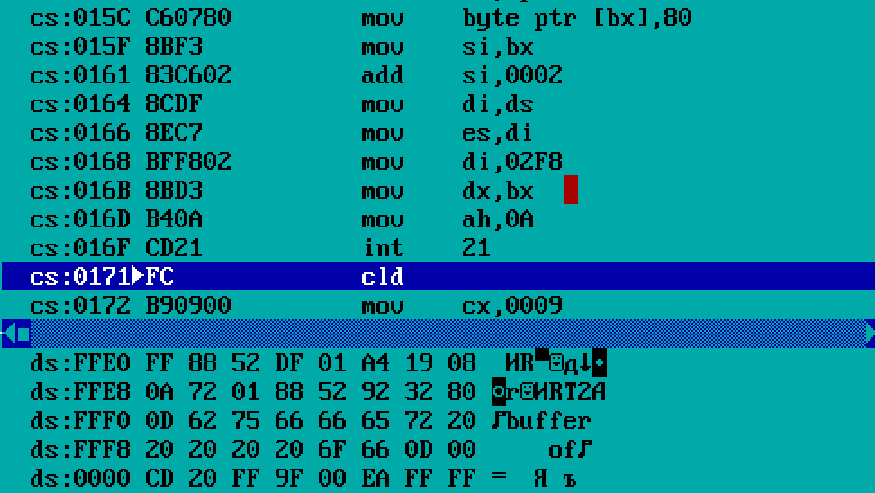
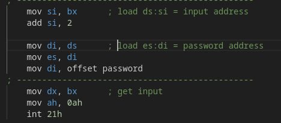

# ASM CRACK SPOILERS

## ABOUT

Для защиты доступа был осуществлен перехват прерывания `08h`:

---
> 
---

Которое каждые 256 прерываний генерировало новый пароль с использованием генератора псевдослучайных чисел xorshift16:

---
> 
---

В код было заложено 2 уязвимости:

    - уязвимость переполнения буфера
    - облегчённый доступ к данным

## BUFFER OVERFLOW

Переполнение буфера позволяет переписать данные, доступ к которым должен быть ограничен, таким как сегмент кода и адреса возвратов функций на стеке, что позволяет выполнять вредоносный код. В данной программе ограничение на максимальную длину считываемой строки много больше места, выделенного для неё на стеке, что позволяет переписать адрес возврата и вывести 'correct'. Пример вредоносной строки содержится в HACK.BIN.

Как видно из дебаггера:

---
> 
---

после вызова процедуры `call 0154` на стеке сохранился адрес следующей инструкции `0129` для возврата, но из-за переполнения буфера он перезапишется:

---
> 
---

## DATA ACCESS

Доступ к данным был упрощен тем, что адрес строки для сравнения был загружен в пару `es:di` до того, как было вызвано прерывание `21h`:

---
> 
---

чем может воспользоваться злоумышленник, перехватив прерывание, и тем самым получить пароль. Код для этого предлагается написать самостоятельно.
